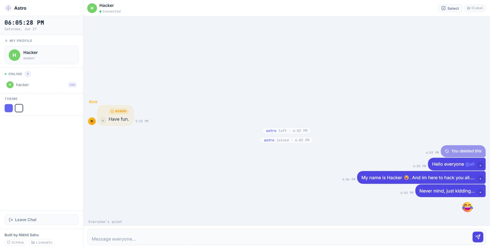

# Astro Chat
A real-time group chat web app with Firebase backend and built-in admin moderation tools. Built for communities that need structured control over their chat — pin messages, hide content, ban users, and broadcast announcements, all without a custom backend.

Built from scratch using vanilla JavaScript, HTML, and CSS.

## Screenshot


---

## Live Demo
[astro-mauve-xi.vercel.app](https://astro-mauve-xi.vercel.app)

---

## Features
- **Real-Time Messaging** — instant sync across all users via Firebase Realtime Database
- **Admin Moderation Panel** — ban, kick, hide, delete messages and flag users directly from the chat
- **Message Pinning** — pin multiple messages with a cycling banner at the top
- **Hidden Messages** — blur message content for regular users; admin sees through with full access
- **Flag System** — users can flag messages; auto-action triggers after a threshold
- **Reply-To** — quote any message with a preview chip; hidden messages show a placeholder instead
- **Context Menu** — role-based dot menu with actions tailored to admin vs regular user
- **Broadcast Announcements** — admin-only system messages pushed to all users
- **Online Presence** — live user list with join/leave tracking
- **Sound Notifications** — audio feedback for sent and received messages
- **Multi-line Support** — write and send messages with proper line breaks preserved

---

## Project Structure
Astro/
├── index.html              # App entry point and layout
├── favicon.png
└── moreFiles/
├── script.js           # All app logic — Firebase, UI, moderation
├── style.css           # Full styling — dark theme, animations, layout
├── sent.wav            # Sound for sent messages
└── received.wav        # Sound for received messages

---

## Setup

```bash
git clone https://github.com/heynick1337/Astro.git
cd Astro
```

Open `index.html` directly in your browser, or serve locally:

```bash
npx serve .
```

> **Note:** This project uses Firebase Realtime Database. Before deploying your own instance, replace the Firebase config in `script.js` with your own project credentials and make sure your Firebase security rules are properly locked down. Never expose sensitive keys in a public repository.

---

## Usage

1. Open the app and enter your username
2. Start sending messages in real time
3. Double-click any message to reply to it
4. Tap `•` on any message to open the context menu

---

## How Key Features Work

### Firebase Sync
All messages, pins, hidden states, flags, and online presence are stored in Firebase Realtime Database. Every change syncs instantly to all connected clients via `onValue` listeners — no polling, no page reload needed.

### Role-Based Context Menu
The `•` menu on each message rebuilds itself dynamically every time it opens, reading live state from `pinnedMsgs`, `hiddenMsgs`, and `myFlags`. Pin/Unpin, Hide/Unhide, and Flag/Unflag always reflect the current state accurately.

### Message Pinning
Multiple messages can be pinned simultaneously. Pins are stored in Firebase so all users see the banner update instantly. Clicking the banner cycles through pinned messages in order, scrolling and highlighting each one.

### Hidden Messages
Hidden messages are blurred for regular users via CSS `filter:blur()`. The dot menu button stays accessible so the owner or admin can always unhide. Admin sees the content unblurred with a dashed outline indicator. Users can still reply to hidden messages — the reply preview shows `🔒 Hidden message` instead of the actual content.

### Flag System
Any user can flag another user's message. Flags are tracked per user in Firebase. When a flag count crosses the configured threshold, an automatic action triggers. Admin can also flag or unflag manually from the context menu.

---

## Security Notes

- **Firebase Rules** — by default Firebase allows open read/write access. Before deploying your own instance, set proper security rules in the Firebase Console to restrict who can read and write data.
- **Admin Access** — admin privileges are controlled server-side via Firebase. Do not rely on client-side checks alone for sensitive operations in a production deployment.
- **Public Repo** — if you fork this project, make sure no API keys, credentials, or sensitive config values are committed to your repository.

---

## Troubleshooting

**Messages not syncing?**
Check your internet connection and verify your Firebase project is active and the config is correct.

**Admin controls not appearing?**
Make sure your username matches the configured admin identity in your Firebase setup.

**Sound not playing?**
Browsers block autoplay audio until the user interacts with the page. Send or receive at least one message first.

---

## Disclaimer
This project is for educational and personal use. The author is not responsible for misuse or data exposure resulting from misconfigured Firebase rules or improper deployment.

---

## Author
**Nikhil Sahu**
- GitHub: [github.com/heynick1337](https://github.com/heynick1337)
- LinkedIn: [linkedin.com/in/sahunikhil01](https://linkedin.com/in/sahunikhil01)
